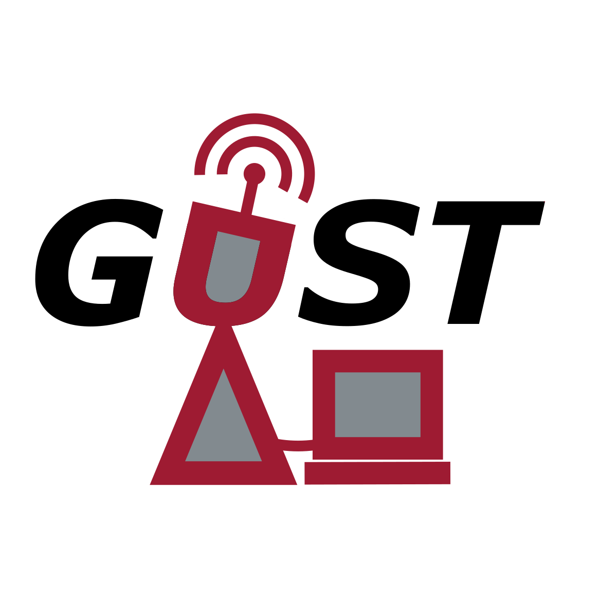

GUST
====

..
    BEGIN INTRO INCLUDE

The Ground Control Station (GCS) for Uncrewed Swarms and Teams (GUST) is an application developed by the `Laboratory for Autonomy, GNC, and Estimation Research (LAGER) <http://lager.ua.edu/>`_ at The University of Alabama. GUST offers comprehensive planning, tracking, command, and control capabilities of an uncrewed swarm for teaming operations. It utilizes the standard MAVLink protocol to communicate with the swarm agents, enabling compatibility with various uncrewed autonomous systems such as Ardupilot based flight computers and Bolder Flight Systems. Full-stack development of GUST was done primarily based on PyQt5 framework. Its software architecture is designed to be modular for easy integration of external plugins and software packages. The GUST application runs inside a docker container making it compatible with any operating system with docker. It is also deployed on a ruggedized ground station box for LAGER’s outdoor survey and remote sensing operations with Uncrewed Aircraft Systems (UAS).

Major Features:

* Capable of relaying real-time telemetry from all connected vehicles to a single Graphical User Interface (GUI) for convenient monitoring.
* Easy integration of external plugins and tools.
* Includes a Target tracking module with a GUI to configure and display real time tracking information from different sensors (example: ZED).
* Includes a Planning module to design flight paths for individual vehicles or cooperative maneuvers for a swarm.
* Provides ability for the ground station operator to command and control each vehicle for some specific tasks or during emergencies.
* Storage of flight data from all vehicles for future analysis.

..
    END INTRO INCLUDE

DEV Setup
=========
..
    BEGIN DEV SETUP INCLUDE

Prerequisites
#############

It is recommended to use Visual Studio Code with Docker Dev Container extension for development of GUST. Development containers allow the full toolchain to be automatically setup on most any machine capable of running Docker. 

* Docker and VS Code: For information and instructions on setting up dev-container, see `here <https://code.visualstudio.com/docs/devcontainers/containers>`__ for an overview, `here <https://stackoverflow.com/questions/71402603/vs-code-in-docker-container-is-there-a-way-to-automatically-install-extensions>`__ for auto installing extensions in the container and `here <https://pspdfkit.com/blog/2020/visual-studio-code-cpp-docker/>`__ for an example setup. The provided dev container also has useful extensions installed to ease development.

* Git : For getting started with git, see `here <https://git-scm.com/book/en/v2/Getting-Started-Installing-Git>`__. If working on Windows, it is recommended to use some emulation tool such as `git Bash <https://www.educative.io/answers/how-to-install-git-bash-in-windows>`__ for using git in command-line interface. Further, it is recommended to add your SSH key to the ssh-agent for authentication. Instructions for checking for existing ssh keys, generating new keys, and adding to github are `here <https://docs.github.com/en/authentication/connecting-to-github-with-ssh/generating-a-new-ssh-key-and-adding-it-to-the-ssh-agent>`__.

Instructions
############

#. Clone the repo.

    .. code-block:: 

        git clone git@github.com:drjdlarson/gust.git
        git submodule init 
        git submodule update

#. Open VS code and navigate to the cloned directory. At this point, VS code should prompt to 'Reopen in Container', click yes. If the prompt doesn't show up, you can go to the command palette and type "Reopen in Container". Now your terminal within VS Code will be running commands within the container but the files you are editing/creating will be accessible from your local machine's file browser.

    * Note: First setup will take some time to setup. After the container starts running, it runs one script to setup some additional stuff (See Dockerfile and .devcontainer.json). 
    * Note: At this point, your working-directory should be "/workspaces/gust/" in your terminal. 
    * Note: You can still use git commands locally (outside the container).

#. At this point, dev environment should be ready for further work. Run the following command to make sure a window shows up. 

    .. code-block:: 

        ./run_gust.bash

See API reference for overview, software architecture, guide, and documentation of packages before starting development with GUST. 

..
    END DEV SETUP INCLUDE

Usage
=====
..
    BEGIN USAGE INCLUDE

Write about deplyoment in hardware and installation process.

..
    END USAGE INCLUDE

API Reference
=============

To generate new documentation, run the script. 

.. code-block:: 

    ./build_scripts/build_documentation.sh -o

If running inside dev container, this should open the documentation in Google Chrome. 

Cite
====
..
    BEGIN CITE INCLUDE

Please cite the framework as follows

.. code-block:: bibtex

    @Misc{gust,
    author       = {Jordan D. Larson and Aabhash Bhandari and Ryan W. Thomas},
    howpublished = {Web page},
    title        = {{GUST}: A {G}round control station (GCS) for {U}ncrewed {S}warms and {T}eams},
    year         = {2022},
    url          = {https://github.com/drjdlarson/gust},
    }

..
    END CITE INCLUDE