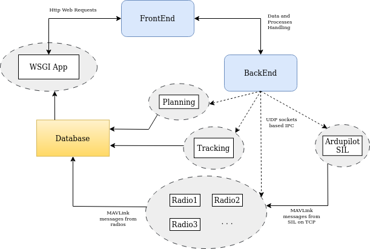

Guide
*****

Software Architecture
=====================

* Frontend includes all the UI design from QtDesigner and logic for all UI windows. To interact with the backend / database, it sends HTTP requests to WSGI App. These requests are sent as URLs formatted with requested information / commands. The HTTP requests typically return a dict to the Frontend that can be displayed in the UI with appropriate formatting.
* WSGI App routes the HTTP requests to specific classes (in wsgi_apps/api/resources/) to perform certain tasks based on the requests' URL.
* Dashed ellipses in above diagram represent components that spawn separate sub-processes. Start / end of these subprocesses are handled by the backend. All these processes have access to the common database.
* radio_manager package handles all communication with the vehicle radios. It includes methods to connect, send, and receive MAVLink messages from the vehicle using dronekit's API.

    * Note : Each radio_manager process is linked to a unique vehicle and is only responsible for communicating with that vehicle. These radio_manager processes run independently enabling multiple vehicle connection.

* All processes are capable of sending messages to the backend via UDP sockets (handled by gust/conn_manager).
* sqlite is used for database. All processes write information to the database, and WSGI app extracts it from the database for frontend display.

Data Flow
=========

Vehicle connection/disconnection
################################

#. When pushbutton_addvehicle is clicked on the main frontend main window, it opens the ConWindow.
#. ConWindow provides several options to the user for vehicle connection. The primary option is the connection type. Based on connection type, other several options are dynamically updated.

    * Radio : MAVLink connection to a radio hardware. User should input vehicle name, select radio port, select baud rate, vehicle color.
    * Ardupilot SIL : MAVLink connection to a SIL on a local TCP port. User should select name and color from dropdowns. Names are populated with the list of SIL names currently running (SIL names are entered when starting a SIL from StartSILWindow). Other options are disabled.
    * Test : Random values imitating MAVLink messages. User should select name and color.

#. Once pushbutton_connect is clicked on ConWindow, it forms an URL including all the selected information for the HTTP Web request.
#. This request is sent to WSGI App which routes the request to ConnInfo class in wsgi_apps/api/resources/drone_namespace
#. ConnInfo class takes all parameters from the received URL and packages into a dictionary. It adds the new connection information in the database and create all necessary tables.
#. Once the vehicle is added to database, it sends the packaged dictionary to ConnServer which is listening to messages on a UDP server socket. To do this, the dictionary is formatted a certain way using utilities.send_info_to_udp_server().
#. When ConnServer receives this message, it spawns a new RadioManager's QProcess for the radio connection. It passes all received information such as name, port, color, baud as arguments to the process. The entrypoint of this new process is radio_manager/cli. Based on received arguments, the radio_manager process starts a dronekit connection with the vehicle.

    * Note : ConnServer assigns a unique UDP address to each radio_manager process. When the process is started, it starts a UDP server socket on that address so that each radio_manager can also be a message listener. This allows other UDP clients (typically ConnServer) to send messages to the radio_manager process.

#. Once the process is successfully started, a response message is sent from ConnServer to Frontend via the same route. This response can also include error message if something fails along the way. If everything is successful, the frontend will add the vehicle in the tableWidget and start updating telemetry data.

    * Note : Disconnection also works the same way. Information flows from Frontend -> WSGI apps -> ConnServer and back for response message. For disconnection, only the vehicle name is passed. When ConnServer receives the disconnection message, it kills the radio_manager process associated with the vehicle.

Starting Ardupilot SIL
######################

#. Running an Ardupilot SIL requires a compiled executable on resources/base/sil_manager. (Currently only supporting Arducopter)
#. Once pushbutton_sil is clicked, it opens the StartSILWindow.
#. User can select different options for the SIL. Similar to ConWindow, it creates a URL for HTTP request and sends it to WSGI App.

    * Note : saved locations for spawing the SIL vehicle are in resources/base/locations.txt

#. Data flow is similar to Steps 4-6 from above Vehicle connection/disconnection section
#. When ConnServer receives this message, it spawns a new SIL QProcess. Similar to radio_manager, it assigns a unique TCP port to each SIL process for communication.
#. Once the process is successfully started, user can connect to the SIL by following all the steps in Vehicle connection/disconnection section above

    * Note : Once a radio is disconnected, it kills the SIL process associated with the vehicle along with its radio_manager process.

MAVLink commands from user to vehicle
#####################################

#. MAVLink messages from the vehicle such as vehicle state are constantly pulled by RadioManager. This telemetry data is stored in the common database.
#. FrontendWindow.update_request() method requests the telemetry data from the database in a constant interval using a helper DataManager class.
#. DataManager sends the HTTP requests to the WSGI App. WSGI App includes classes to handle telemetry data requests.
#. These classes include a 'params' attribute which is a list of all the parameters (or vehicle states) that class can request. It pulls the latest value stored for each of the params in the database tables.

    * Note : The strings in the params list are hardcoded in the database side as well. Basically, these params are the headers for the tables in database. So, please do not change these 'params' if you are not sure what you are doing.

#. The return from the database is packaged as a dict including values for all requested parameters for all vehicles.
#. This dict is passed to the frontend window as a return of the HTTP request.
#. Frontend window's DataManager class reorganizes the received dicts into a single dict containing all telemetry data for all vehicles. Once this is done, it emits a signal which is caught by the FrontendWindow.update_frame() method.
#. FrontendWindow.update_frame() updates the UI everytime new data is received from the DataManager.

Backend data handling by ConnServer
###################################

#. At the beginning of the program, the backend starts ConnServer as a thread. ConnServer includes a UDP server socket that constantly listens to messages from other processes.
#. If a message is received from a socket client, it tries to determine the message type.

    * Note : All UDP socket messages used in GUST are always sent with a 'message_type'. Message types are defined in utilities.ConnSettings.

#. Based on the message_type, ConnServer forwards the message to appropriate methods as arguments.
#. It can also send response to the UDP socket clients.

Instructions
============

Building new UI windows with QtDesigner
#######################################

#. The UI for all windows are designed using QtDesigner. Open Designer app by running

.. code-block::

    Designer

#. Design your UI. Please be consistent with the naming of Qt objects with current style (i.e. include Qt object type in the name).

    * Example : If adding a pushbutton (QPushButton) to open a file, name it ``pushButton_openfile``. If adding a dropdown (QComboBox) to display available colors, name it ``comboBox_colors``.

#. Once you save the file, go to the terminal (inside gust's root directory) and run the python script to convert UI files to python files.

.. code-block::

    python convert_ui_files.py

#. The python files with the same name will be saved in gust.gui.ui directory. You should be able to run the converted python file to preview the UI (just like in Designer).

    * Note : Never make any edits to any of the autogenerated python files.

#. To write logic for the new window, create a new python file in gust.gui. Import the autogenerated python file and create a new class for the window inheriting from the UI class in the autogenerated python file. This gives you access to all the UI elements in the new gust.gui file (See examples).

    * Note : This is done to keep the code for window's logic and UI aspects separate. This just makes things cleaner as we have so many windows for gust.

Add more areas in the map
#########################

* Step 1
* Step 2

Adding more Ardupilot SIL models
################################

* Step 1
* Step 2

Adding more colors for vehicles
###############################

* Step 1
* Step 2

Indices and tables
==================

* :ref:`genindex`
* :ref:`modindex`
* :ref:`search`